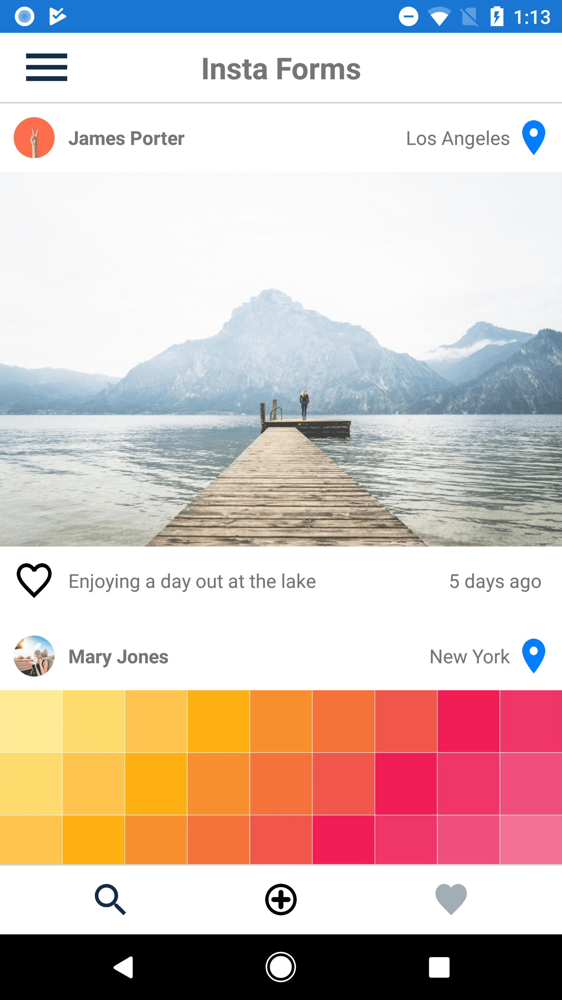
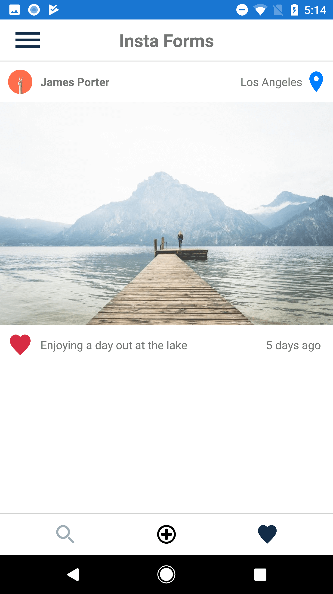
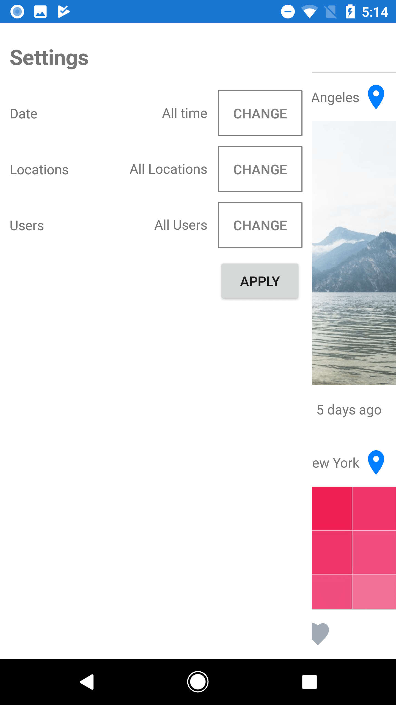

# InstaForms
A simple Instagram style app made with Xamarin Forms

## Purpose
Should serve as a quick introduction to cross-platform Xamarin Forms apps

## Features

- Add new images from device gallery and camera app
- Like photos by tapping the heart button or double tapping a post
- Filter posts by Date, Location and User
- Scroll to top by tapping the InstaForms title

### Homescreen

### Liked posts page

### Filter posts

## Road map
Open to requests